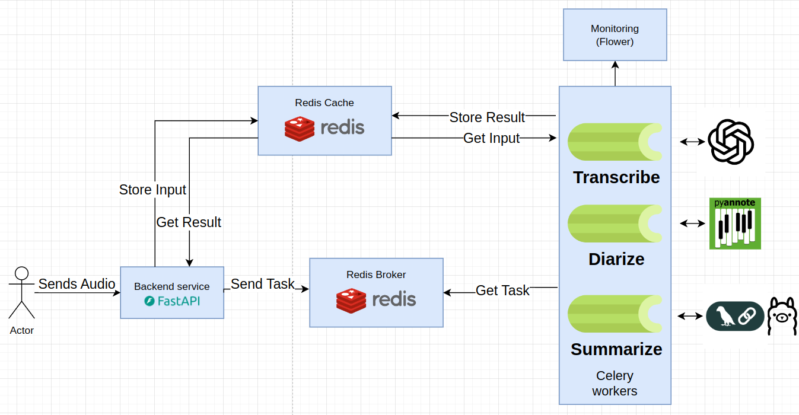

# 📝 Meeting Report Generation Solution 

    

A full-stack solution for generating **structured meeting reports** from audio recordings using **FastAPI**, **Celery**, **Redis**, and **LLMs**.

[View Demo](https://1drv.ms/f/c/06B1F6E174C6D6D9/EsRUpJ4b-BRKhNdrDmjUhVUB04W7E-poZNarFesncu0gZA?e=yARlZP)


---

## 🚀 Features

- ⚡ **Asynchronous & scalable** task handling  
- 🗣️ **Parallel transcription & diarization**  
- 📝 **Structured conversation & summary generation**  
- 📄 **Automated PDF report export**  
- 🌐 **Distributed architecture** powered by Redis  
- 🤖 **LLM-powered summarization** with Ollama  
- 📊 **Real-time monitoring** via Flower  

---

## 🏗️ Architecture Overview

### 1️⃣ FastAPI Endpoint
- Accepts audio uploads and validates formats  
- Submits tasks to **Celery** for asynchronous processing  
- Provides endpoints to:
  - Check task status
  - Retrieve results
  - Export reports (PDF/Markdown)  

### 2️⃣ Celery Workers
Processes audio in **three phases**:

1. **Transcription** – Converts speech to text  
2. **Diarization** – Identifies speakers and segments audio  
3. **Conversation Mapping** – Merges transcription & speaker info into structured multi-turn conversations  

### 3️⃣ Summarization Agent
- Uses **Ollama LLM** to generate:
  - 📝 Concise summary  
  - ✅ Actions to take  
  - 🎯 Decisions made  
  - 📌 Topics discussed  

### 4️⃣ Report Generation
- Automatically produces a **PDF report** from structured summary for end users  


## 📊 Workflow



---

## 💻 Tech Stack

     

---

## 📂 Project Structure

```
.
├── alembic/                 # Database migrations
├── app/                     # Main application package
│   ├── api/                 # API endpoints
        ├── summarize.py          # summarization endpoint
        └── ..
│   ├── core/                # Core functionality (config, security)
│   ├── db/                  # Database session and base
│   ├── models/              # SQLAlchemy models
│   ├── schemas/             # Pydantic schemas
        ├── langchain.py          # langchain pydantic schemas
        └── ..
│   ├── services/            # Business logic
        ├── transcribe/           # transcription task
│       ├── diarize/              # diarization task
│       ├── conversation/         # conversation creation task
│       ├── summarize/            # summarization task
│       ├── cache.py              # cache store logic
│       ├── celery_worker.py      # celery worker logic
│       └── ..
│   └── utils/               # Utility functions
├── docker-compose.yml       # Docker Compose for production
├── docker-compose.dev.yml   # Docker Compose for development
├── Dockerfile               # Docker configuration for app
├── celery.dockerfile        # Docker configuration for celery worker
├── alambic.ini              # Alembic configuration
├── main.py                  # Application entry point
├── pyproject.toml           # Project dependencies and metadata
├── start.sh                 # Production startup script
└── start-dev.sh             # Development startup script
```

## How to Run
### Option 1: Using Docker Compose

Start all services with:
```bash
docker-compose up --build
```
### Option 2: Using Kubernetes
The instruction below will do the following :
1. setup kind and use it to create a local kubernetes cluster.
2. setup kubectl and configure it to use the kind cluster.
3. build the required docker images and push them to the cluster.
4. apply the k8s manifests.
5. apply port forwarding to expose the web service to the world .

Start all services with:
```bash
chmod +x setup-k8s.sh
./setup-k8s.sh
```
### To run integration tests:
```bash
pytest -v 
```

## API Documentation

Once the application is running, you can access:

- Swagger UI: http://localhost:8000/docs
- ReDoc: http://localhost:8000/redoc

## 🔑 API Endpoints

### Summarization

| Method | Endpoint | Description |
|--------|----------|-------------|
| POST   | `/summarize/query` | Upload audio file for summarization |
| GET    | `/summarize/get_result` | Check task status |
| GET    | `/summarize/export/pdf` | Export result as PDF |

### System

| Method | Endpoint | Description |
|--------|----------|-------------|
| GET    | `/health` | Health check endpoint |

---

## ⚙️ Configuration

Configure the application via environment variables (e.g., in a `.env` file):

| Variable | Description | Default |
|----------|-------------|---------|
| `HF_TOKEN` | HF Token with access to pyannote/speaker-diarization-3.1 and pyannote/segmentation-3.0 | `supersecretkey` |
| `DIARIZATION_MODEL` | Diarization model | `pyannote/speaker-diarization-3.1` |
| `WHISPER_SIZE` | Whisper model size | `small` |
| `SAMPLE_RATE` | Audio sample rate | `16000` |
| `MODEL_NAME` | LLM model name | `qwen3:1.7b` |
| `OLLAMA_URL` | Ollama service URL | `http://ollama:11434` |
| `REDIS_HOST` | Redis host | `redis` |
| `REDIS_PORT` | Redis port | `6379` |
| `REDIS_BROKER_DB` | Redis broker DB index | `0` |
| `REDIS_CACHE_DB` | Redis cache DB index | `1` |
| `OUTPUT_FOLDER` | Folder to store generated PDFs | `./output` |


---

### 📝 Ending Note

This solution is designed to be **production-ready, modular, and scalable**, with clear separation between API, services, and background tasks. It demonstrates end-to-end processing of meeting audio files—from **upload** to **structured summary** to **PDF report export**—making it a strong showcase of full-stack AI engineering skills for real-world applications.

